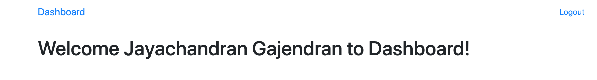
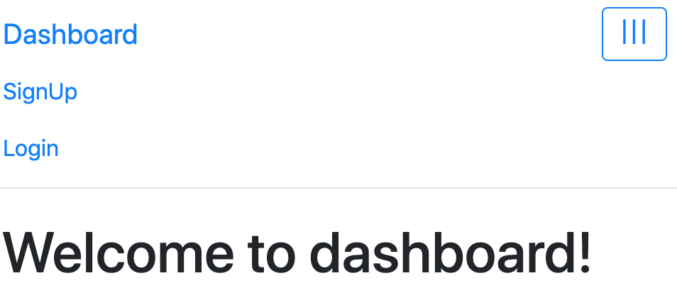
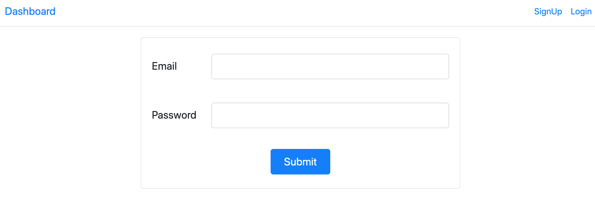
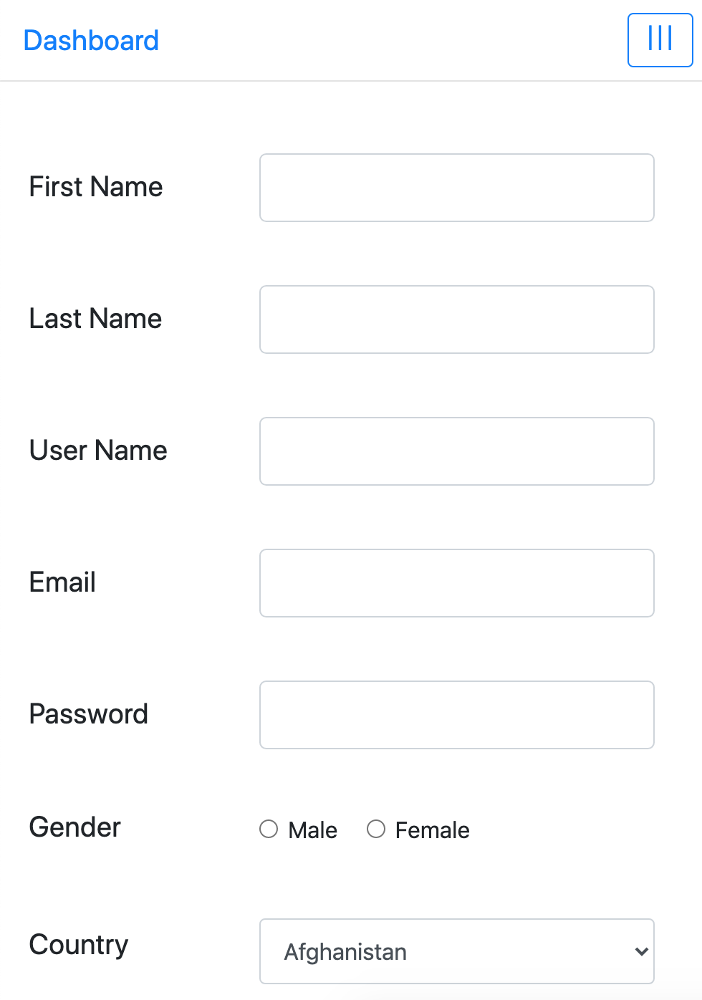
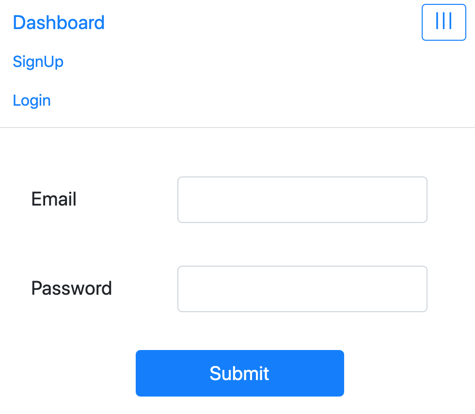
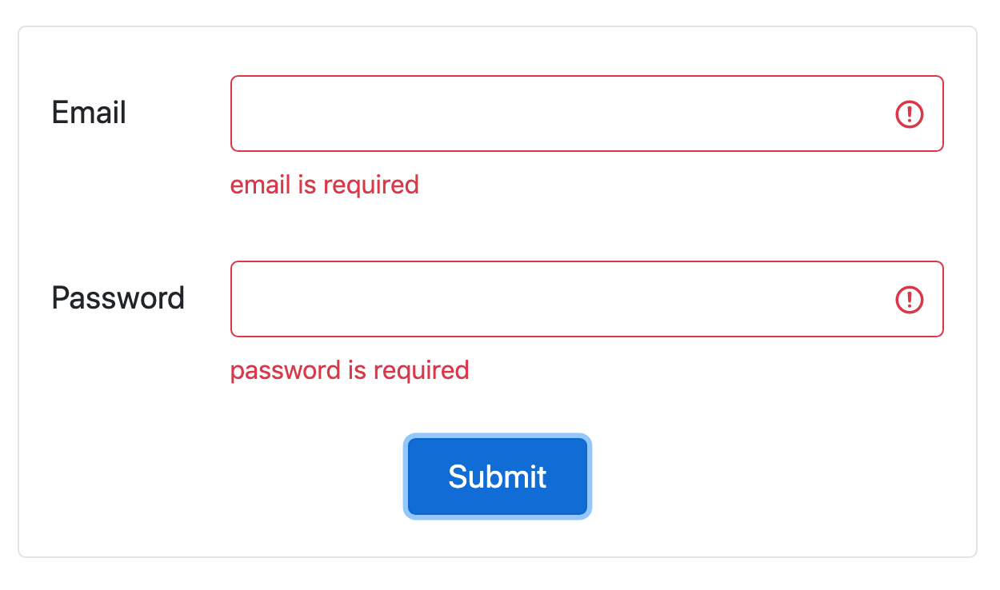

# userRegistration

This app is developed to create new user registration and authentication through Node / Express - Mongoose

## Development Client

Run `npm run start` for a dev server. Navigate to `http://localhost:3000/`. The app will automatically reload if you change any of the source files.

# Client
 npm run start
 
## Development Server

Run `npm run server` for a dev server. Navigate to `http://localhost:5000/`. The app will automatically reload if you change any of the source files.

# Server
npm run server

# Screenshots

# Logged User View.

# Default Mobile View

# Login Desktop View

# Registration Mobile View

# Login Mobile View

# Validation

